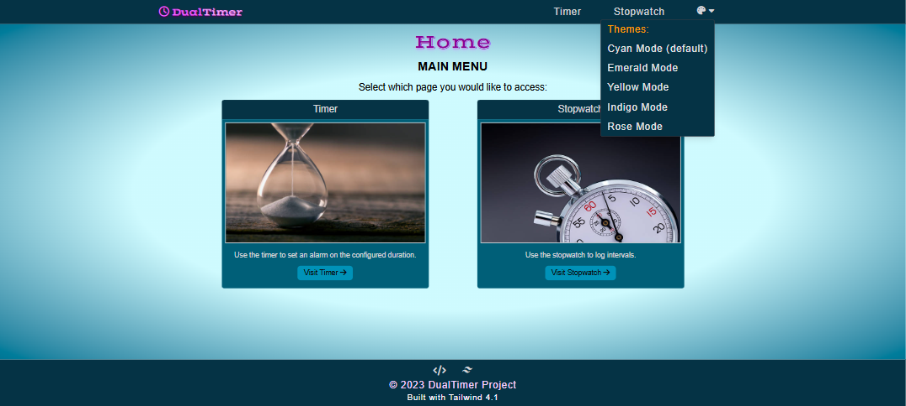
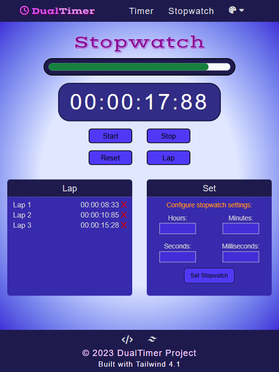
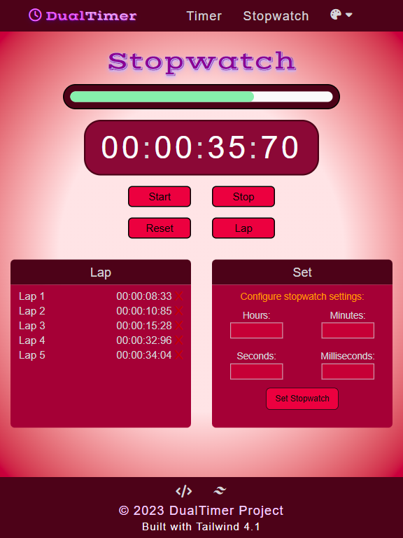
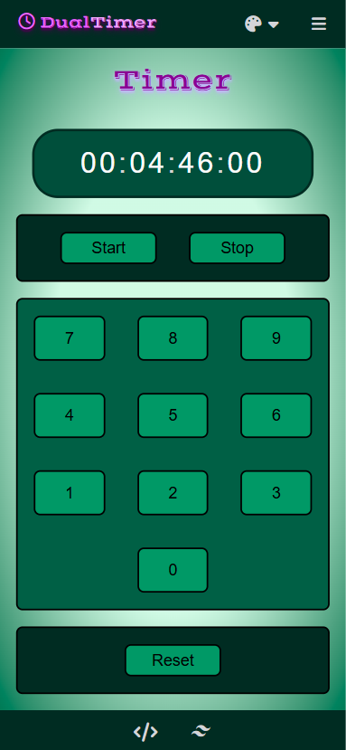
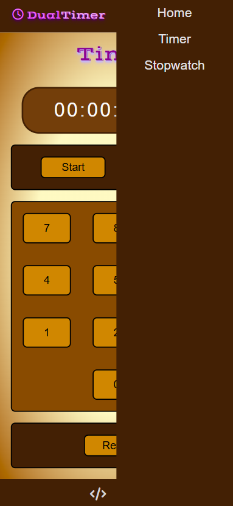

# DualTimer
**DualTimer** is an interactive web application, built with [Tailwind](https://tailwindcss.com/ "Tailwind"), designed to run two independent timers simultaneously. It is an object-oriented program that makes use of JavaScript OOP principles (e.g. class constructors, methods and properties), DOM manipulations and template literals.

## Setup Instructions
#### 1. Clone the Repoistory:
Enter the following in the terminal or command line:

```
git clone https://github.com/vkumar-2/DualTimer.git
cd DualTimer
```

Alternatively, download the repository zip file [here](https://github.com/vkumar-2/DualTimer/archive/refs/heads/main.zip "here").

#### 2. Open index.html:
Begin application by opening the file **index.html** located in `DualTimer/src/index.html`.

## Features
### Tech Stack:
- **Tailwind** - utility-first CSS framework applied for rapid and responsive UIs.
- **Web APIs** - in-built browser APIs (e.g. DOM and intervals) to apply timings to the DualTimer project.
- **JavaScript** - ES6 implemented for performing logic, including: timer control, interval handling and state management.

### Interactive Components:
- **Timer & Stopwatch** - configure and start a countdown and stopwatch timer.
- **Themes** - change the website theme to any of the following colours: cyan (default), emerald, yellow, indigo, rose.

## Images
### Home - Desktop View:
| Cyan Theme |
| ------------ |
|  |

### Stopwatch - Tablet View:
| Indigo Theme | Rose Theme|
| ------------ | ------------ |
|  |  |

### Timer - Smartphone View:
| Emerald Theme | Yellow Theme|
| ------------ | ------------ |
|  |  |